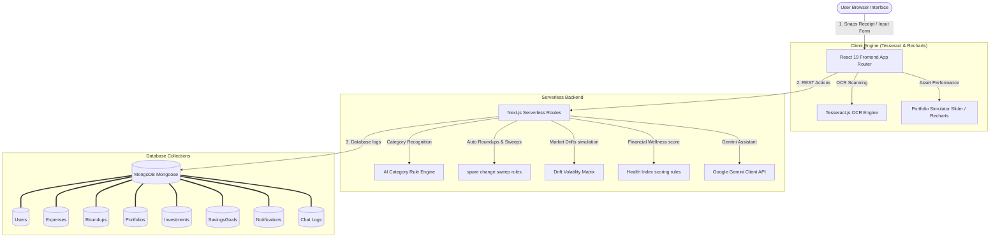

# InvestEase AI 🚀

**InvestEase AI** is a premium, financial wellness and virtual micro-investment platform designed to solve a universal consumer problem: people spend money daily without realizing how minor, unused fractions (change margins) can build compounding wealth over time. 

Instead of another static expense logging CRUD app, **InvestEase AI** automatically captures spare changes on transaction clearances, allocates them according to custom asset distributions, and sweeps them into a virtual portfolio simulator. It is packed with browser-based OCR receipt scanning, dynamic Recharts visualizations, a financial health scoring engine, and a fallback AI Spending Coach.

---

## ✨ Features

- **🛡️ Secure Credentials Authentication**: Seamless login and signup workflows powered by **NextAuth.js** featuring cryptographic **bcryptjs** password hashing and instant demo seeding checks.
- **💰 Automatic Spare Change Sweep**: Intercepts expense entries, automatically calculates spare change margins (e.g., rounding up a ₹421.65 expense to ₹422.00, sweeping ₹0.35), and allocates it across user-defined asset portfolios.
- **📈 Smart Portfolio Simulator**: Real-time virtual investment portfolio simulator supporting custom allocations across 5 asset classes (Index Funds, Mutual Funds, Stocks, Gold, and Crypto). Features Brownian motion-based market drift simulation to educationalize risk.
- **🔍 In-Browser OCR Receipt Scanner**: Powerful client-side optical character recognition powered by **Tesseract.js** that parses uploaded transaction images and extracts amount, vendor, category, and date directly in-browser to avoid server load bottlenecks.
- **📊 Advanced Analytics Dashboard**: Dynamic, interactive financial reports visualising compounding timelines, asset allocations, and category expense distributions using **Recharts** charts.
- **🎯 Savings Goals Pots**: Dedicated target milestones (e.g., Emergency Fund, Bike, Macbook) tracking progressive savings with visual meters.
- **🚦 Category Budgets & Alerts**: Establish monthly limits per spending category with live status thresholds and system notifications.
- **🎛️ Financial Health Scoring Engine**: Algorithmic assessment calculating user financial wellness (0-100 score) based on emergency fund status, budget utilization, necessity weights, savings margins, and diversification indices.
- **💬 Hybrid AI Spending Coach**: Interactive conversation assistant powered by **Google Gemini API** (`gemini-3.5-flash` model) that provides custom budgeting advice, transaction analysis, and tailored financial feedback.
- **⚡ Instant Demo Seeding**: A quick-launch gate that builds a simulated account with 6 months of historical budgets, goals, and transactions instantly for seamless evaluation.

---

## 👥 Development Team
This is a collaborative team project designed and built by:

Prince Jha
Sachin Jha

---

## 🛠️ Technology Stack

- **Frontend Framework**: [React.js 19](https://react.dev/) & [Next.js 16 (App Router)](https://nextjs.org/)
- **Backend Framework / Runtime**: [Node.js](https://nodejs.org/) with Express-style Serverless API Endpoints (Next.js serverless API routes architecture)
- **Programming Language**: [TypeScript](https://www.typescriptlang.org/)
- **Database**: [MongoDB](https://www.mongodb.com/)
- **Object Modeling (ORM/ODM)**: [Mongoose ODM](https://mongoosejs.com/)
- **Authentication**: [NextAuth.js](https://next-auth.js.org/)
- **Password Encryption / Security**: [Bcrypt.js](https://github.com/dcodeIO/bcrypt.js) (for cryptographic hashing verification)
- **AI Model Integration**: [Google Gemini Pro API](https://ai.google.dev/) (`gemini-3.5-flash` model for advisory spending coach logic)
- **OCR Text Processing Engine**: [Tesseract.js](https://tesseract.projectnaptha.com/) (in-browser optical character recognition)
- **Interactive Data Visualization**: [Recharts](https://recharts.org/) (for rendering compounding growth timelines, asset allocations, and KPI indicators)
- **Aesthetic UI Animation**: [Framer Motion](https://www.framer.com/motion/) (for smooth animations and transitions)
- **Styling**: [Tailwind CSS v4](https://tailwindcss.com/) (custom dark design system and styling utility classes)
- **Icons**: [Lucide React](https://lucide.dev/)
- **Flowcharts & System Mapping**: [Mermaid.js](https://mermaid.js.org/) (for rendering system architectures within documentation)

---

## 🗺️ System Architecture



---

## 📁 Project Structure

```
InvestEase-AI/
├── src/
│   ├── app/                          # Next.js App Router Pages
│   │   ├── page.tsx                  # Premium Startup Landing Page
│   │   ├── login/page.tsx            # Login panel with demo account shortcut
│   │   ├── register/page.tsx         # Signup form with instant DB seeding hooks
│   │   ├── dashboard/page.tsx        # Overview stats, categories pie charts, KPI meters
│   │   ├── expenses/page.tsx         # Transaction ledger & Tesseract OCR scanning panel
│   │   ├── budget/page.tsx           # Category spend thresholds tracker
│   │   ├── savings/page.tsx          # Savings goals pots (Macbook, emergency fund)
│   │   ├── portfolio/page.tsx        # Smart Portfolio Simulator allocations sliders
│   │   ├── health/page.tsx           # Financial health index scores & radial gauges
│   │   ├── analytics/page.tsx        # Category shares & compound growth timeline charts
│   │   ├── ai-assistant/page.tsx     # Spending coach dialogue interface
│   │   ├── profile/page.tsx          # Income & notify settings preferences
│   │   ├── settings/page.tsx         # Dark mode configuration and password controls
│   │   └── api/                      # Serverless API endpoints
│   │       ├── expenses/route.ts     # CRUD ledger and auto roundup sweeps engine
│   │       ├── expenses/scan/route.ts # Receipt image OCR text parser
│   │       ├── portfolio/route.ts    # Get details / update allocation parameters
│   │       ├── portfolio/simulate/route.ts # Drift asset balances based on volatility
│   │       ├── dashboard/route.ts    # Aggregates KPI balances and history logs
│   │       ├── register/route.ts     # User signup & automatic demo populate seeders
│   │       ├── settings/password/route.ts # Password validation & update flow (bcryptjs)
│   │       └── chat/route.ts         # Hybrid Gemini Spending coach fallback advisor
│   ├── components/                   # Shared React UI Components
│   │   ├── ThemeProvider.tsx         # Context-managed dark styling provider
│   │   ├── ClientLayout.tsx          # Structural layout viewport splitter
│   │   ├── Sidebar.tsx               # Left dashboard navigation bar
│   │   └── ReceiptScanner.tsx        # Drag-and-drop Tesseract canvas processor
│   ├── lib/                          # Database connection and backend helper rules
│   │   ├── db.ts                     # Cached MongoDB Mongoose initialization
│   │   ├── auth.ts                   # NextAuth credentials authentication configuration
│   │   ├── gemini.ts                 # Gemini configuration & history sanitization helper
│   │   ├── rules/
│   │   │   └── health.ts             # Financial Health score calculator rules engine
│   │   └── models/                   # Mongoose Database Models
│   │       ├── User.ts               # User schema
│   │       ├── Expense.ts            # Expense transactions schema
│   │       ├── Roundup.ts            # Spare change transaction margins
│   │       ├── Portfolio.ts          # Holdings balances across 5 asset classes
│   │       ├── Investment.ts         # Log of sweeps history
│   │       ├── SavingsGoal.ts        # Target pots metrics
│   │       ├── Notification.ts       # Logs of alert notifications
│   │       └── Chat.ts               # Chat log contexts
├── public/                           # Vector icons and site static assets
├── scratch/                          # Diagnostics script directory (ignored in git)
│   └── test_scan.js                  # Local parser testing harness
├── .gitignore                        # Git configuration mappings
├── .env.example                      # Production environment variables seeding template
├── package.json                      # Project dependencies and workspace scripts
├── tsconfig.json                     # TypeScript settings config
└── README.md                         # Master Hackathon Documentation
```

---

## 🗄️ Database Schema & Models

- **User**: Contains profile details, monthly salary, and target savings percentages.
- **Expense**: Stores transactional entries including transaction amounts, categories, vendors, dates, and OCR-extracted logs.
- **Roundup**: Tracks fraction difference margins computed on transaction clearances (e.g. ₹0.35 saved from a ₹421.65 expense).
- **Portfolio**: Tracks aggregate holding balances across the 5 asset classes (Stocks, Index Funds, Mutual Funds, Gold, Crypto).
- **Investment**: Logs detailing applied sweep histories and allocation weights.
- **SavingsGoal**: Stores milestones target pots (e.g., Emergency Fund, Bike, Macbook) and progress trackers.
- **Notification**: Alerts history detailing overspent notifications, target limits, and return simulator drift logs.
- **Chat**: Holds persistent conversational context data for the Google Gemini AI spending coach.

---

## 🔌 Serverless API Endpoints

- **`GET /api/dashboard`**: Aggregates general user statistics, transaction trends, and dynamic KPI balances.
- **`GET | POST /api/expenses`**: Fetches the transaction history log and posts new expenses. Automatically runs the roundups sweep logic.
- **`POST /api/expenses/scan`**: Accepts file uploads to process and parse client-side receipt images, responding with structured transaction values.
- **`GET | PUT /api/portfolio`**: Obtains investment distribution holdings and updates custom percentage allocations (must sum to 100%).
- **`POST /api/portfolio/simulate`**: Triggers a Brownian motion market drift volatility simulator to recalculate portfolio balances.
- **`GET /api/health`**: Runs logic evaluating budgets, savings, and assets to update user's financial wellness index score.
- **`POST /api/settings/password`**: Handles password updates via cryptographic bcrypt verification.
- **`POST /api/chat`**: Initiates Gemini AI conversation completions containing user profiles and financial contexts.

---

## 💻 Local Setup & Installation

Follow these steps to configure and run the InvestEase AI development environment on your machine:

### Prerequisites
Make sure you have the following installed:
- [Node.js](https://nodejs.org/) (v18.x or higher recommended)
- [MongoDB](https://www.mongodb.com/try/download/community) (either running locally or a MongoDB Atlas Cloud URI)

---

### Step-by-Step Guide

### 1. Clone the Repository
```bash
git clone https://github.com/pjha91275/InvestEase-AI.git
cd InvestEase-AI
```

### 2. Install Project Dependencies
```bash
npm install
```

### 3. Configure Environment Variables
Create a file named `.env` in the root of the project:
```bash
# Windows command line / PowerShell:
New-Item .env -ItemType File
```
Open `.env` and configure the following variables:
```env
# Database Connection URI
MONGODB_URI=mongodb://127.0.0.1:27017/investease

# NextAuth Configuration
NEXTAUTH_URL=http://localhost:3000
NEXTAUTH_SECRET=generate_a_random_32_character_string_here

# Google Gemini API Key
GEMINI_API_KEY=your_google_gemini_api_key_here
```

### 4. Run the Development Server
Ensure your MongoDB server is active, then launch the Next.js local compiler:
```bash
npm run dev
```
Open your browser and navigate to **[http://localhost:3000](http://localhost:3000)**.

### 5. Seed Initial Demo Data
- Go to the Login Page at `/login`.
- Click **"Launch Instantly with Demo Account"** to automatically create the `demo@investease.ai` user and populate 6 months of historical budgets, goals, transactions, and swept micro-investments.

### 6. Build for Production
To build and optimize the project for deployment:
```bash
npm run build
npm run start
```

---

## ☁️ Deployment

When deploying to platforms like **Vercel**, **Netlify**, or **Render**:
1. Do **not** commit `.env` to Git.
2. In the hosting provider's dashboard, configure the Production Environment variables:
   - `MONGODB_URI` -> Point to a live **MongoDB Atlas** database cloud string.
   - `NEXTAUTH_URL` -> Set to the live website URL (e.g. `https://yourdomain.com`).
   - `NEXTAUTH_SECRET` -> Generate a new cryptographically secure secret.
   - `GEMINI_API_KEY` -> Your live Google Gemini API Key.

---

## 🚶 Recommended Demo & Testing Script

To review the primary features of the platform step-by-step:

1. **Overview Dashboard**: Highlight the CRED-style dark-mode widgets at `/dashboard`.
2. **Ledger & OCR Scanner**: Click **Scan Receipt** at `/expenses`. Upload an invoice to trigger auto-fields.
3. **Roundup Sweeps**: Log a fractional cost transaction (e.g., ₹324.15 at Zomato). Dynamic categorization pre-selects **Food**, and ₹0.85 is automatically swept.
4. **Simulate Market Returns**: Navigate to `/portfolio`. Adjust sliders to rebalance targets and click **Simulate Market Movement** to trigger drift variance notifications.
5. **Timeline Growth**: Go to `/analytics` to view the compounding timeline growth charts.

---

## 🔮 Future Scope & Improvements

- **📱 Mobile App SMS Scraper**: Build a companion mobile application (React Native/Flutter) with background SMS reading permissions to intercept real-time UPI and debit card transaction alerts, automating micro-investments without manual input.
- **🏦 Real-World Broker Integrations**: Integrate live brokerage APIs (e.g., Zerodha, Groww, Upstox) or sandbox digital gold/mutual fund APIs to route virtual sweeps into actual assets.
- **👨‍👩‍👧‍👦 Family Co-Investment Pools**: Allow partners or families to combine spare changes to build joint emergency pots and achieve common saving goals.
- **🤖 Autonomous Financial Agent**: Implement self-executing budget rebalancing suggestions, automated threshold adjustments based on historic spending patterns, and voice-assisted AI coaching.

---

## ⚖️ License
This project is licensed under the ISC License.
